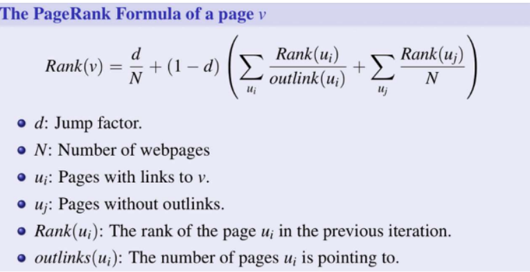

# 🚀 Parallel PageRank Implementation 

This project is a **parallel C++ implementation of the PageRank algorithm**, developed as part of the *Parallel Programming* course assignment .  
The implementation features **custom-built Graph** and a **thread-based PageRank engine using C++ standard threads (std::thread)**.  
No external libraries or given templates were used — the thread pool and graph structure were written manually.

---

## 🌐 What is PageRank?

**PageRank** is a link analysis algorithm developed by Larry Page and Sergey Brin at Stanford University in 1996 to rank web pages in search engine results.  
It models a **random surfer** who clicks links at random and occasionally jumps to a random page.

> *"PageRank works by counting the number and quality of links to a page to determine a rough estimate of how important the website is."*

---

## 📐 PageRank Formula

Below is the formal PageRank formula used to compute the rank of a page `v`:


---

## 🧠 Explanation

In simple words, **PageRank** gives each web page a “score” based on how many and how good are the links pointing to it.  
The higher the score, the more “important” the page is assumed to be.

> Note: While modern search engines use many more signals today, PageRank was the foundational idea used by Google in its early search algorithm.

---

## 🧪 Visual Example

The graph below shows a sample PageRank result. Node size and percentage reflect the calculated importance:


---

## ⚡ Parallel Pseudocode

The following pseudocode outlines how the PageRank algorithm was parallelized using a custom thread pool:

```text
ParallelPageRank(G, n):

  d ← 0.15
  N ← number of nodes in G
  For all nodes v in G (in parallel):
      Rank[v] ← 1/N

  While n > 0:
    Create empty Rank_next[0..N-1]
    total_dangling ← 0

    For all nodes u with no outlinks (in parallel):
        atomic add Rank[u] to total_dangling

    For all nodes v in G (in parallel using thread pool):
        sum ← 0
        For all incoming uᵢ to v:
            sum += Rank[uᵢ] / out_degree(uᵢ)
        Rank_next[v] ← d/N + (1-d)*(sum + total_dangling / N)

    Rank ← Rank_next
    n ← n - 1

  return Rank
```

---

## 📁 Project Structure

```plaintext
PageRank/
│
├── src/
│   ├── main.cpp            # Entry point (for testing only)
│   ├── pageRank.cpp        # PageRank algorithm logic
│   ├── graph.cpp           # Custom Graph implementation
│   └── ThreadPool.cpp      # Custom ThreadPool implementation
│
├── include/
│   ├── pageRank.hpp
│   ├── graph.hpp
│   └── ThreadPool.hpp
│
├── Makefile
├── README.md
└── .gitignore
```

---

## ⚙️ Build & Run

```bash
make       # Build the executable
./pagerank # Run the program
make clean # Remove build artifacts
```

---

## ✅ Features

- Custom **parallel PageRank** using C++17 threads (`std::thread`)
- Implements both **Graph** and **ThreadPool** manually (from scratch)
- Handles **dangling nodes** by redistributing weight across all pages
- Modular structure, suitable for expansion

---

## 🧑‍💻 Author

Naor Dahan  
📧 naor.meir@gmail.com  
🔗 [github.com/Naor-meir](https://github.com/Naor-meir)

---

## 📚 References

- [Wikipedia: PageRank](https://en.wikipedia.org/wiki/PageRank)
- [Churchill-Aloha: PageRank Explanation](https://churchill-aloha.medium.com/pagerank-algorithm-explanation-code-2fb6c0389bed)
- [YouTube: PageRank Algorithm](https://www.youtube.com/watch?v=meonLcN7LD4)
